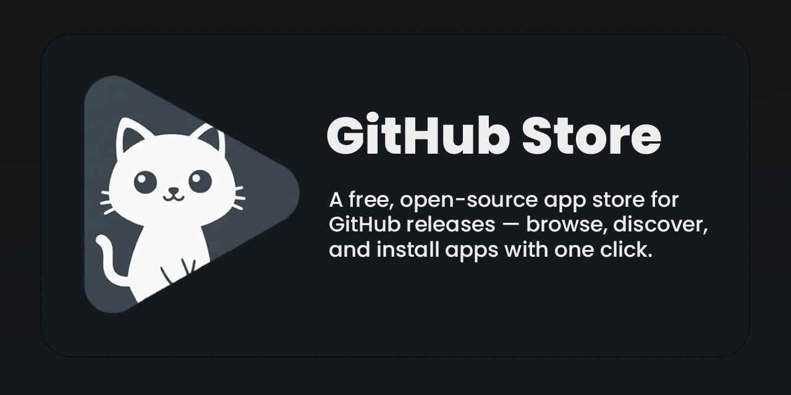
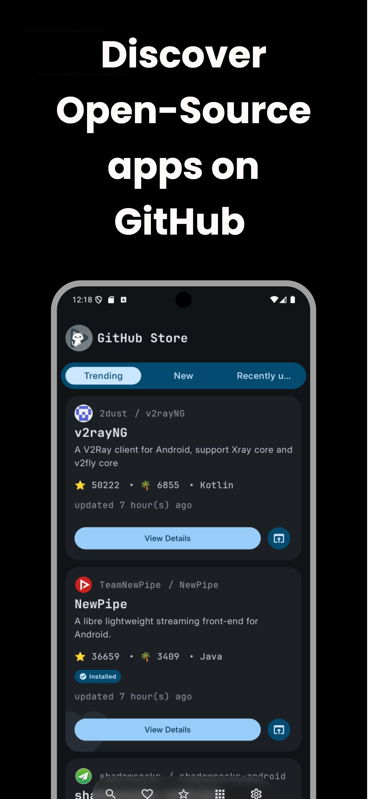
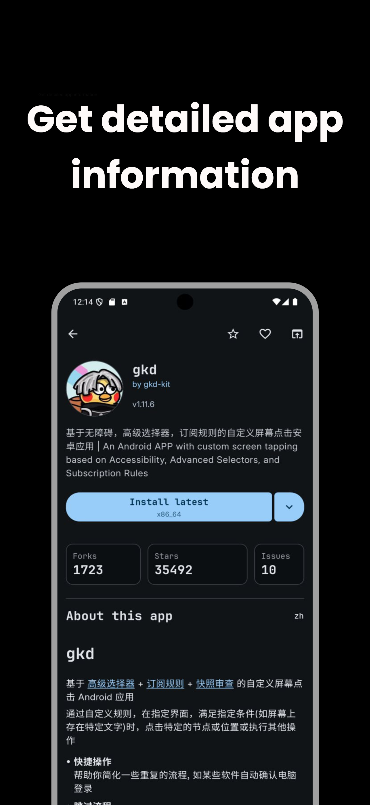
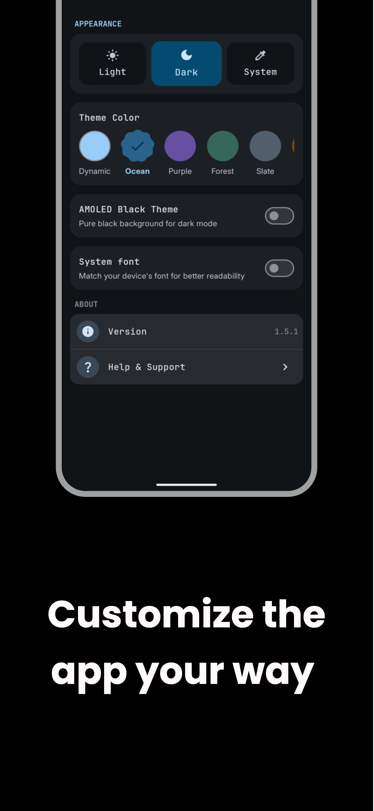
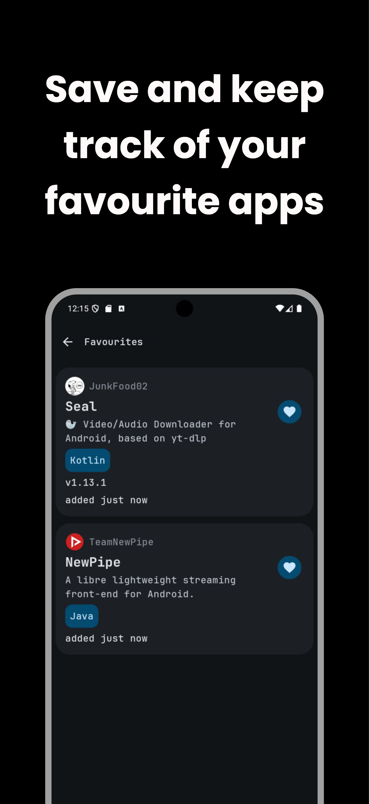
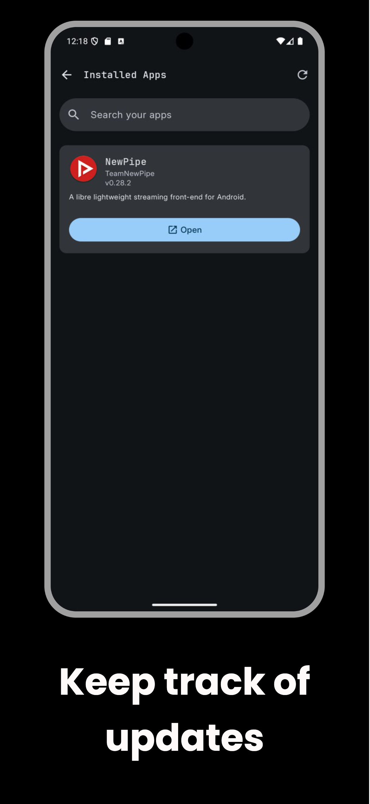

<div align="center">
</br>


</div>

<div align="center">

# GitHub Store

</div>

</br>

<p align="center">
  </a>
  </a>
  </a>
  </a>
  </br>
  </br>


<a href="https://github.com/OpenHub-Store/GitHub-Store/stargazers">

</a>


</br>
</br>

<a href="https://github.com/OpenHub-Store/GitHub-Store/releases/latest">
  
</a>

<a href="https://f-droid.org/packages/zed.rainxch.githubstore">
  
</a>

</br>
</br>


<p align="center">
  <a href="https://trendshift.io/repositories/15655" target="_blank">

<a href="https://hellogithub.com/en/repository/OpenHub-Store/GitHub-Store" target="_blank">
  
</a>
</p>

</p>

<p align="center">
<a href="/README.md">English</a> | <a href="/docs/README-ES.md">Español</a> | <a href="/docs/README-FR.md">Français</a> | <a href="/docs/README-IT.md"><b>Italiano</b></a> | <a href="/docs/README-RU.md">Русский</a> | <a href="/docs/README-PL.md">Polski</a> | <a href="/docs/README-TR.md">Türkçe</a> | <a href="/docs/README-ZH.md">中文</a> | <a href="/docs/README-JA.md">日本語</a> | <a href="/docs/README-KR.md">한국어</a> | <a href="/docs/README-BN.md">বাংলা</a> | <a href="/docs/README-HI.md">हिन्दी</a>
</p>

<div align="center">

# 🗺️ Panoramica del progetto

GitHub Store e un app store multipiattaforma per le release di GitHub, progettato per semplificare la scoperta e l'installazione di software open source. Rileva automaticamente i file binari installabili (APK, EXE, DMG, AppImage, DEB, RPM), offre l'installazione con un solo clic, tiene traccia degli aggiornamenti e presenta le informazioni dei repository in un'interfaccia pulita in stile app store.

Realizzato con Kotlin Multiplatform e Compose Multiplatform per piattaforme Android e Desktop.

</div>

> [!CAUTION]
> Android libero e open source e sotto minaccia. Google trasformera Android in una piattaforma chiusa, limitando la vostra liberta essenziale di installare le app che preferite. Fate sentire la vostra voce – [keepandroidopen.org](https://keepandroidopen.org/).

<p align="middle">
    
    
    
    
    
    
</p>

<div align="center">

# 📔 Wiki e risorse

Consulta la [Wiki](https://github.com/OpenHub-Store/GitHub-Store/wiki) di GitHub Store per domande frequenti e informazioni utili

🌐 **Sito web:** [github-store.org](https://github-store.org)
💬 **Discord:** [Unisciti alla community](https://discord.gg/x9Cvh2Z9qS)
📜 **Informativa sulla privacy:** [github-store.org/privacy-policy](https://github-store.org/privacy-policy/)

</div>

---

<div align="center">

### 📋 Avviso legale

GitHub Store e un progetto open source indipendente, non affiliato a GitHub, Inc.
Il nome descrive la funzionalita dell'applicazione (scoprire le release di GitHub) e non implica la proprieta di alcun marchio registrato.
GitHub® e un marchio registrato di GitHub, Inc.

</div>

---

<div align="center">

# 🔃 Scarica

</div>

<p align="center">
<a href="https://github.com/OpenHub-Store/GitHub-Store/releases">
   
</a>
<a href="https://f-droid.org/en/packages/zed.rainxch.githubstore/">
   
</a>
<a href="https://apps.obtainium.imranr.dev/redirect.html?r=obtainium://add/https://github.com/OpenHub-Store/GitHub-Store/">
  
</a>
</p>

<p align="center">
  <a href="https://discord.gg/x9Cvh2Z9qS">
  
</a>
</p>

> [!IMPORTANT]
> **Utenti macOS:** Potreste visualizzare un avviso che indica che Apple non puo verificare GitHub Store. Questo accade perche l'applicazione viene distribuita al di fuori dell'App Store e non e ancora autenticata (notarized). Consentitela tramite Impostazioni di Sistema → Privacy e Sicurezza → Apri comunque.

---

<div align="center">

# 🏆 Presente in

</div>

<p align="center">
<a href="https://www.youtube.com/@howtomen">
  
</a>
</br>
<strong>HowToMen:</strong> <a href="https://www.youtube.com/watch?v=7favc9MDedQ">Top 20 Migliori App per Android 2026</a> | <a href="https://www.youtube.com/watch?v=VR-MEwPDw4k">Top 12 App Store Migliori di Google Play Store</a>
</br>
<strong>HelloGitHub:</strong> <a href="https://hellogithub.com/en/repository/OpenHub-Store/GitHub-Store">Progetto in evidenza</a>
</p>

---

## 🚀 Funzionalita

- **Scoperta intelligente**
    - Sezioni nella home per progetti "Trending", "Hot Release" e "Most Popular" con filtri basati sul tempo.
    - Vengono mostrati solo i repository con file installabili validi.
    - Punteggio dei topic basato sulla piattaforma, cosi gli utenti Android/desktop vedono le app pertinenti per primi.
    - Ricerca rinnovata con migliore classificazione per rilevanza e prestazioni.

- **Browser delle release e installazione**
    - Selettore delle release per esplorare e installare da qualsiasi release, non solo dalla piu recente.
    - Recupera tutte le release di ogni repository.
    - Azione unica "Installa ultima versione", piu un menu a tendina di tutte le release disponibili e i relativi installer.
    - Opzione di installazione manuale con controlli di compatibilita automatici.

- **Schermata dettagli completa**
    - Nome dell'app, versione, pulsante "Installa ultima versione" e azione di condivisione.
    - Stelle, fork, issue aperte.
    - Contenuto del README renderizzato ("Informazioni su questa app").
    - Note della release con formattazione Markdown per qualsiasi release selezionata.
    - Elenco degli installer con etichette di piattaforma e dimensioni dei file.
    - Supporto deep link — apri i dettagli del repository direttamente tramite URL.
    - Schermata del profilo dello sviluppatore per esplorare i repository e l'attivita di uno sviluppatore.

- **Gestione delle app**
    - Apri, disinstalla e riporta a versioni precedenti le app installate direttamente da GitHub Store.
    - Android: corrispondenza dell'architettura APK (armv7/armv8), monitoraggio dei pacchetti e tracciamento degli aggiornamenti.
    - Desktop (Windows/macOS/Linux): scarica gli installer nella cartella Download dell'utente e li apre con il gestore predefinito.

- **Repository preferiti**
    - Salva e esplora i tuoi repository preferiti di GitHub direttamente dall'applicazione.

- **Rete e prestazioni**
    - Supporto proxy dinamico per l'instradamento di rete configurabile.
    - Sistema di cache migliorato per un caricamento piu rapido e un minor utilizzo delle API.

- **UX multipiattaforma**
    - Android: splash screen nativo, gestione della scadenza della sessione e icona adattiva.
    - Desktop: supporto AppImage su Linux prioritario insieme ai formati DEB e RPM.
    - Localizzato in 12 lingue: inglese, spagnolo, francese, giapponese, coreano, polacco, russo, cinese, bengalese, hindi, italiano e turco.

---

## 🔍 Come appare la mia app in GitHub Store?

GitHub Store non utilizza alcun tipo di indicizzazione privata ne regole di curatela manuale.
Il tuo progetto puo apparire automaticamente se soddisfa queste condizioni:

1. **Repository pubblico su GitHub**
    - La visibilita deve essere `public`.

2. **File installabili nell'ultima release**
    - L'ultima release deve contenere almeno un file con un'estensione compatibile:
        - Android: `.apk`
        - Windows: `.exe`, `.msi`
        - macOS: `.dmg`, `.pkg`
        - Linux: `.deb`, `.rpm`, `.AppImage`
    - GitHub Store ignora gli artefatti del codice sorgente generati automaticamente (`Source code (zip)` /
      `Source code (tar.gz)`).

3. **Individuabile tramite ricerca / topic**
    - I repository vengono ottenuti tramite l'API pubblica di ricerca di GitHub.
    - I topic, il linguaggio e la descrizione aiutano nella classificazione:
        - App per Android: topic come `android`, `mobile`, `apk`.
        - App desktop: topic come `desktop`, `windows`, `linux`, `macos`, `compose-desktop`,
          `electron`.
    - Avere almeno alcune stelle aumenta la probabilita di comparire nelle sezioni Trending/Hot Release/Most Popular.

Se il tuo repository soddisfa queste condizioni, GitHub Store puo trovarlo tramite la ricerca e mostrarlo
automaticamente, senza necessita di invio manuale.

---

## 🧭 Come funziona GitHub Store (panoramica)

1. **Ricerca**
    - Utilizza l'endpoint `/search/repositories` di GitHub con query adattate alla piattaforma.
    - Applica un punteggio semplice basato su topic, linguaggio e descrizione.
    - Filtra i repository archiviati e quelli con pochi segnali.

2. **Verifica delle release e dei file**
    - Per i repository candidati, chiama `/repos/{owner}/{repo}/releases/latest`.
    - Verifica l'array `assets` alla ricerca di estensioni di file specifiche per la piattaforma.
    - Se non viene trovato alcun file adeguato, il repository viene escluso dai risultati.
    - Gli utenti possono anche esplorare tutte le release tramite il selettore delle release.

3. **Schermata dettagli**
    - Informazioni del repository: nome, proprietario, descrizione, stelle, fork, issue.
    - Browser delle release: naviga tra qualsiasi release con la relativa etichetta, data, changelog e file.
    - README: caricato dal branch principale e renderizzato come "Informazioni su questa app".
    - Link al profilo dello sviluppatore e azione di condivisione.
    - Accessibile tramite deep link per la navigazione diretta.

4. **Processo di installazione**
    - Quando l'utente tocca "Installa ultima versione" o seleziona una release specifica:
        - Seleziona il file piu adatto alla piattaforma corrente (con corrispondenza dell'architettura su Android).
        - Trasmette il download con supporto cache.
        - Delega all'installer del sistema operativo (installer APK su Android, gestore predefinito su desktop).
        - Su Android, registra l'installazione in un database locale e utilizza il monitoraggio dei pacchetti per mantenere sincronizzata la lista delle app installate.
        - Supporta le azioni di apertura, disinstallazione e downgrade per le app gestite.

---

## ✅ Vantaggi / Perche usare GitHub Store?

- **Basta cercare tra le release di GitHub**
  Visualizza solo i repository che distribuiscono effettivamente binari per la tua piattaforma.

- **Sa cosa hai installato**
  Tiene traccia delle app installate tramite GitHub Store (Android) e segnala quando sono disponibili nuove release, cosi puoi aggiornarle senza cercare di nuovo su GitHub.

- **Sempre aggiornato**
  Le installazioni utilizzano per impostazione predefinita l'ultima release pubblicata, con la possibilita di esplorare e installare da
  qualsiasi release precedente tramite il selettore delle release.

- **Esperienza uniforme su tutte le piattaforme**
  La stessa interfaccia e logica per Android e desktop, con comportamento di installazione nativo della piattaforma.

- **Open source ed estensibile**
  Scritto in KMP con una separazione netta tra rete, logica di dominio e interfaccia utente — facile da forkare,
  estendere o adattare.

---

## 🔐 Certificato di firma APK di GitHub Store

Tutte le release ufficiali di GitHub Store sono firmate con la seguente impronta digitale del certificato:

SHA-256:
`B7:F2:8E:19:8E:48:C1:93:B0:38:C6:5D:92:DD:F7:BC:07:7B:0D:B5:9E:BC:9B:25:0A:6D:AC:48:C1:18:03:CA`

---

## 🔑 Configurazione OAuth GitHub

**Riepilogo**
1. Crea una GitHub OAuth App
2. Copia il **Client ID**
3. Inseriscilo in `local.properties`

<details>
<summary><strong>Mostra la guida completa alla configurazione</strong></summary>

  <br/>

### 1 - Creare una GitHub OAuth App
Vai su:
**GitHub → Settings → Developer settings → OAuth Apps → New OAuth App**

| Campo                          | Valore                                       |
| ------------------------------ | ------------------------------------------- |
| **Application name**           | A tua scelta (es. *GitHub Store Dev*) |
| **Homepage URL** | `https://github.com/username/repo_name`                   |
| **Authorization callback URL** | `githubstore://callback`                    |

Poi clicca su **Create application**.

### 2 - Copiare il Client ID
Dopo aver creato l'app, GitHub mostrera:
- **Client ID** ← questo e quello che ti serve
- **Client Secret** ← ❗ NON necessario per questo progetto

### 3 - Aggiungerlo al tuo progetto
Apri il file `local.properties` del tuo progetto (radice del progetto) e aggiungi:
```properties
GITHUB_CLIENT_ID=YOUR_CLIENT_ID_HERE
```

### 4 - Sincronizzare e avviare
Sincronizza il progetto e avvia l'app. Ora dovresti poter accedere con GitHub.

### ❗ Note importanti
- `local.properties` **non viene caricato su Git**, quindi il tuo Client ID rimane locale.
- Questo progetto necessita solo del **Client ID** (non del Client Secret).
- Ogni sviluppatore dovrebbe creare la propria OAuth app per lo sviluppo.

</details>

---

## ☕ Supporta il progetto

**GitHub Store** ha raggiunto **piu di 48.000 utenti attivi** e **piu di 5.500 stelle su GitHub** — ed e **100% gratuito** senza pubblicita, senza tracciamento e senza funzionalita premium.

L'ho costruito e lo mantengo completamente da solo mentre finisco il liceo. Il tuo supporto (anche solo $3) mi aiuta a:

✅ **Mantenere l'app priva di bug** — rispondere alle issue e rilasciare correzioni rapidamente
✅ **Aggiungere funzionalita richieste dalla community** — implementare cio di cui gli utenti hanno davvero bisogno
✅ **Mantenere l'infrastruttura** — server, API e costi di distribuzione

### 💖 Modi per supportare

<a href="https://www.buymeacoffee.com/rainxchzed">
  
</a>

<a href="https://github.com/sponsors/rainxchzed">
  
</a>

**Non puoi sponsorizzare in questo momento?** Nessun problema! Puoi anche aiutare:
- ⭐ **Mettendo una stella a questo repository** — aiuta altri a scoprire GitHub Store
- 🐛 **Segnalando bug** — migliora l'app per tutti
- 📢 **Condividendolo con gli amici** — spargi la voce tra altri sviluppatori
- 💬 **Unendoti al nostro [Discord](https://discord.gg/x9Cvh2Z9qS)** — i tuoi commenti plasmano la roadmap

Ogni forma di supporto — finanziaria o meno — significa molto e mantiene questo progetto vivo. Grazie!

---

## ⚠️ Avvertenza

GitHub Store ti aiuta solamente a scoprire e scaricare file di release gia pubblicati su
GitHub da sviluppatori esterni.
I contenuti, la sicurezza e il comportamento di tali download sono responsabilita esclusiva dei loro
rispettivi autori e distributori, non di questo progetto.

Utilizzando GitHub Store, comprendi e accetti che installi e esegui qualsiasi software scaricato
a tuo rischio e pericolo.
Questo progetto non esamina, convalida ne garantisce che alcun installer sia sicuro, privo di malware o
adatto a qualsiasi scopo particolare.

---

## Cronologia stelle

<a href="https://www.star-history.com/#OpenHub-Store/GitHub-Store&type=timeline&legend=top-left">
 <picture>
   <source media="(prefers-color-scheme: dark)" srcset="https://api.star-history.com/svg?repos=OpenHub-Store/GitHub-Store&type=timeline&theme=dark&legend=top-left" />
   <source media="(prefers-color-scheme: light)" srcset="https://api.star-history.com/svg?repos=OpenHub-Store/GitHub-Store&type=timeline&legend=top-left" />
   
 </picture>
</a>


## 📄 Licenza

GitHub Store e distribuito sotto la **Licenza Apache, Versione 2.0**.

```
Copyright 2025 rainxchzed

Licensed under the Apache License, Version 2.0 (the "License");
you may not use this project except in compliance with the License.
You may obtain a copy of the License at

  http://www.apache.org/licenses/LICENSE-2.0

Unless required by applicable law or agreed to in writing, software
distributed under the License is distributed on an "AS IS" BASIS,
WITHOUT WARRANTIES OR CONDITIONS OF ANY KIND, either express or implied.
See the License for the specific language governing permissions and
limitations under the License.
```
